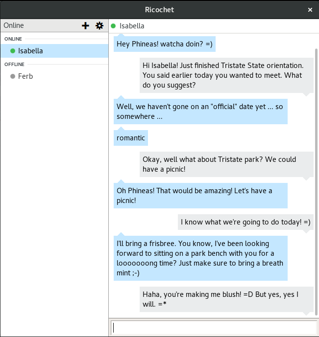

### Anonymous metadata-resistant instant messaging that just works.
Ricochet is an experimental kind of instant messaging that **doesn't trust anyone** with your identity, your contact list, or your communications.

* You can chat without exposing your identity (or IP address) to *anyone*
* Nobody can discover who your contacts are or when you talk (*metadata-free!*)
* There are no servers or operators that could be compromised, exposing your information.
* It's cross-platform and easy for non-technical users.

### How it works
Ricochet is a peer-to-peer instant messaging system built on the Tor Network [hidden services](https://www.torproject.org/docs/hidden-services.html.en). Your login is your hidden service address, and contacts connect to you (not an intermediate server) through Tor. The rendezvous system makes it extremely hard for anyone to learn your identity from your address.

Ricochet is not affiliated with or endorsed by The Tor Project.

For more information, you can [read about Tor](https://www.torproject.org/about/overview.html.en) and [learn about Ricochet's design](https://github.com/ricochet-im/ricochet/blob/master/doc/design.md) or [protocol](https://github.com/ricochet-im/ricochet/blob/master/doc/protocol.md) (or the [old protocol](https://github.com/ricochet-im/ricochet/blob/master/doc/deprecated/protocol-1.0.txt)). Everything is [open-source](https://github.com/ricochet-im/ricochet/blob/master/LICENSE) and open to contribution.

### Experimental
This software is an experiment. Security and anonymity are difficult topics, and you should carefully evaluate your risks and exposure with any software. *Do not rely on Ricochet for your safety* unless you have more trust in my work than it deserves. That said, I believe it does more to try to protect your privacy than any similar software, and is the best chance you have of withholding your personal information.

### Downloads

Ricochet is available for Windows, OS X (10.7 or later), and as a generic Linux binary package. Visit the [releases page](https://github.com/ricochet-im/ricochet/releases) for the latest version and changelog.

All releases and signatures are also available at https://ricochet.im/releases/.

Binaries are PGP signed by `9032 CAE4 CBFA 933A 5A21 45D5 FF97 C53F 183C 045D`.

### Building from source
See [BUILDING](https://github.com/ricochet-im/ricochet/blob/master/BUILDING.md) for Linux, OS X, and Windows build instructions.

### Other
Bugs can be reported on the [issue tracker](https://github.com/ricochet-im/ricochet/issues). Translations can be contributed on [Transifex](https://www.transifex.com/projects/p/ricochet/).

You can contact me at `ricochet:rs7ce36jsj24ogfw` or `john.brooks@dereferenced.net`.

You should support [The Tor Project](https://www.torproject.org/donate/donate.html.en), [EFF](https://www.eff.org/), and [run a Tor relay](https://www.torproject.org/docs/tor-relay-debian.html.en).
